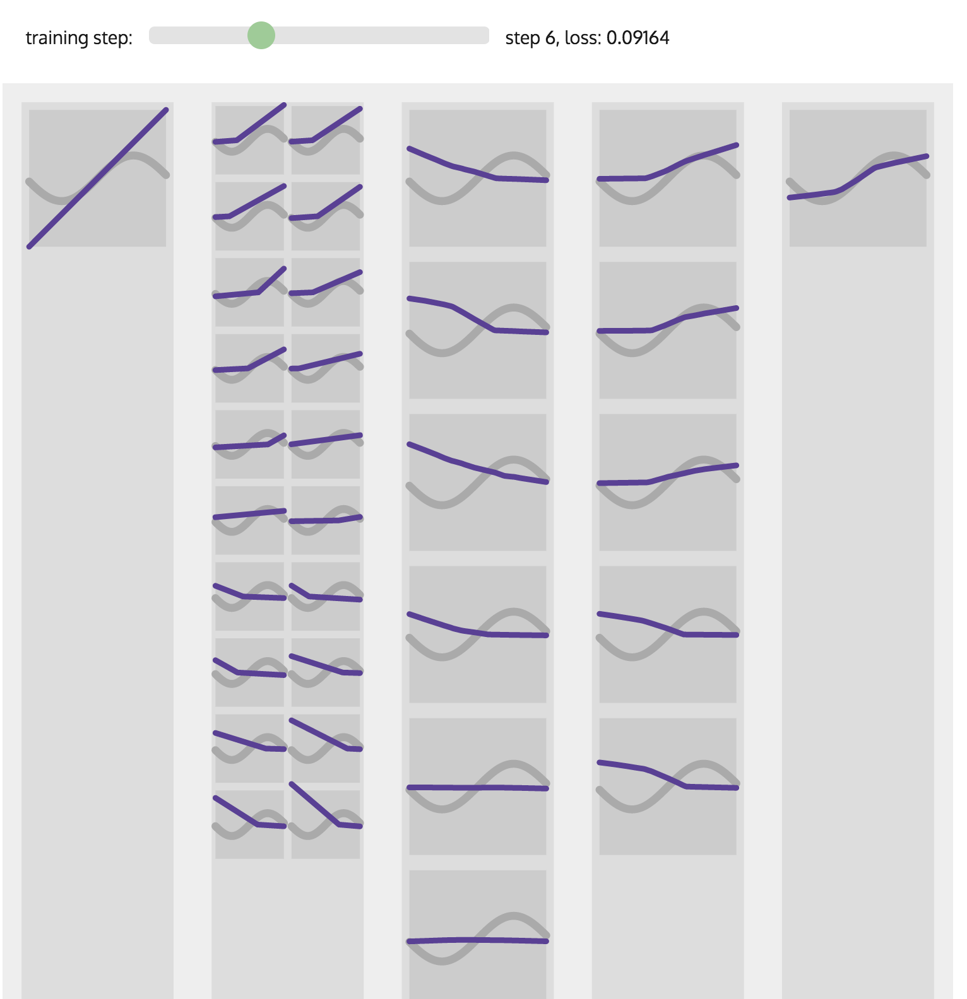

# A toy viz of fully connected neural networks

## Features
- Neurons are sorted by their similarity

## Limitations
- It works for networks that intend to solve a scalar input, scalar output (i.e. $f: \Re \rightarrow \Re$) regression/classification problem.
- It works for small networks, i.e. ~4 layers, up to ~50 neurons per layer, due to svg render limitations.

## Usage
Open index.html for a demo.

## Detail
### dump.py
is a demo script that train a network, record and dump intermediate data (e.g. intermediate training weights/biases, layer activations, loss values, optimized layouts) into a js file (with var data = [...list of intermediate states...]). 
### index.html
then loads data.js and contains scripts for visualizing all activation levels at each training stage.
